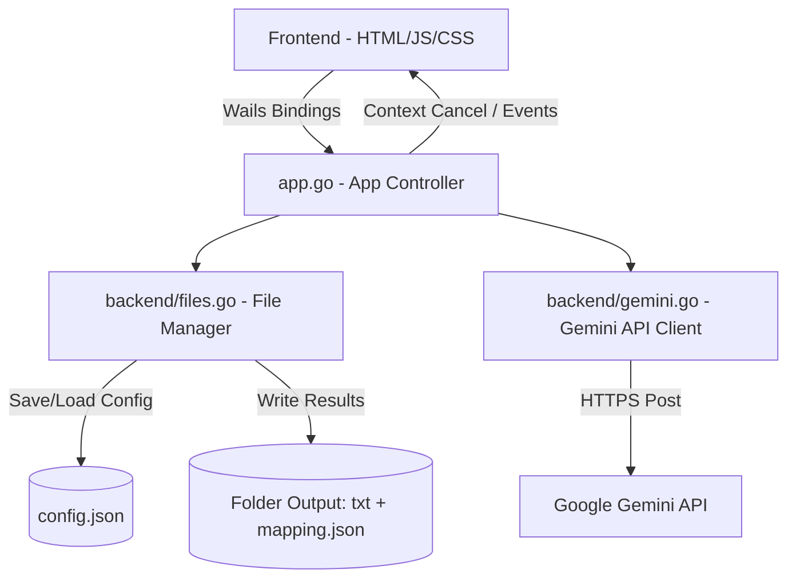

# Google Model Tester 🚀

> Trình kiểm thử và so sánh hiệu năng tóm tắt của các mô hình ngôn ngữ lớn (Gemini LLMs) từ Google.
> Được phát triển bằng **Wails v2** (Go Backend + HTML/JS/CSS Frontend) với phong cách thiết kế hiện đại **Glassmorphism**.

---

## 🌟 Tính Năng Nổi Bật

*   **So Sánh Đa Mô Hình (Multi-Model):** Cho phép cấu hình danh sách các mô hình Gemini (`gemini-1.5-flash`, `gemini-1.5-pro`...) và so sánh hiệu năng/chất lượng tóm tắt trực quan giữa các mô hình này.
*   **Danh Sách Văn Bản Động (Dynamic Text Inputs):** Giao diện quản lý nhiều đoạn văn bản cần so sánh một cách độc lập thông qua giao diện thẻ trực quan. Hỗ trợ thêm/xóa/sao chép nội dung cực kỳ linh hoạt với hiệu ứng chuyển động mượt mà.
*   **Bảo Mật Cấu Hình Tuyệt Đối:** Lưu trữ an toàn Gemini API Key, danh sách mô hình, Custom System Prompt và thư mục đầu ra tại file `config.json` nằm trong thư mục cấu hình chuẩn của hệ thống (`os.UserConfigDir`).
*   **Ma Trận Tiến Trình Trực Quan (Process Matrix):** Hiển thị trạng thái chạy song song/tuần tự của từng mô hình trên mỗi đoạn văn bản dưới dạng lưới màu sắc sống động (Chờ chạy, Đang chạy, Thành công, Thất bại).
*   **Hệ Thống Log Console Thời Gian Thực:** Giúp theo dõi chi tiết từng tác vụ, thời gian phản hồi (Response Time) và bắt lỗi API chi tiết của Gemini.
*   **Tính Năng Copy-to-Clipboard Thông Minh:** Mỗi thẻ nhập liệu đều tích hợp nút sao chép nhanh với hiệu ứng đổi icon tích xanh (✓) phản hồi xúc giác trong 1.5 giây.
*   **Chú Thích Ký Hiệu File (Legend):** Tự động tạo chú thích ánh xạ giữa tên ký hiệu file lưu trữ (`model_1`, `model_2`...) và tên thật của mô hình ở sidebar để người dùng dễ dàng đối chiếu.
*   **Chế Độ Giả Lập (DRY RUN):** Nhập API Key là `DRY_RUN` để chạy thử nghiệm đầy đủ quy trình tóm tắt, đo lường thời gian phản hồi giả lập (từ 1.0s đến 2.0s) mà không cần gọi đến API thật.
*   **Hỗ Trợ Hủy Tiến Trình (Cancel):** Cho phép người dùng dừng khẩn cấp quá trình chạy hàng loạt bất cứ lúc nào thông qua `context.WithCancel` ở Go Backend.

---

## 📐 Kiến Trúc Dự Án

Ứng dụng kết hợp sức mạnh xử lý phần cứng và file của **Go** cùng giao diện giàu tính năng, mượt mà của **Vanilla JavaScript & CSS**:



### 1. Go Backend (Core Logic)
*   `main.go`: Điểm khởi chạy ứng dụng Wails, thiết lập cấu hình cửa sổ, kích thước và liên kết struct `App`.
*   `app.go`: Controller chính kết nối Frontend và Backend. Quản lý việc mở hộp thoại chọn thư mục OS bản xứ, chạy tiến trình bất đồng bộ (`goroutine`) cho tóm tắt hàng loạt và bắn các sự kiện thời gian thực bằng `runtime.EventsEmit`.
*   `backend/gemini.go`: Triển khai HTTP Client thủ công cho Gemini API, hỗ trợ Custom System Prompt (`systemInstruction`) và phân tích phản hồi lỗi từ Google API.
*   `backend/files.go`: Quản lý lưu/tải tệp cấu hình toàn hệ thống, ghi file kết quả kèm thời gian phản hồi chi tiết, và tạo file `mapping.json` lưu giữ metadata.

### 2. Frontend (UI/UX)
*   `frontend/index.html`: Cấu trúc trang sử dụng HTML5 ngữ nghĩa, phông chữ Google Fonts (Inter & Outfit), tích hợp các icon SVG gọn gàng, tinh tế.
*   `frontend/src/style.css`: Hệ thống CSS tối tân với hiệu ứng kính mờ (Glassmorphism), thiết kế đáp ứng (Responsive Grid), thanh tiến trình động, và hoạt hoạt ảnh `slideIn` khi thêm textareas mới.
*   `frontend/src/main.js`: Logic quản lý trạng thái (`state`), xử lý sự kiện DOM động, tương tác clipboard, và lắng nghe sự kiện Wails (`EventsOn`, `EventsOff`) để cập nhật giao diện thời gian thực.

---

## 📂 Quy Cách Đầu Ra Kết Quả

Khi hoàn thành tiến trình tóm tắt, các tệp kết quả sẽ được lưu vào Thư mục đầu ra được chỉ định với cấu trúc cực kỳ khoa học:

1.  **Các tệp tóm tắt cá nhân:** `model_X-vb_Y.txt`
    *   Ví dụ: `model_1-vb_1.txt` lưu trữ kết quả tóm tắt của mô hình số 1 trên văn bản số 1.
    *   *Nội dung file:*
        ```text
        Response Time: 1.42s (1420ms)
        ---
        [Nội dung tóm tắt chuyên nghiệp trả về từ Gemini...]
        ```
2.  **Tệp ánh xạ metadata:** `mapping.json`
    *   Giúp đối chiếu chính xác ký hiệu ảo trong tên file sang thực tế mà không gây nhầm lẫn hay làm lộ tên mô hình dài dòng trên cấu trúc thư mục.
    *   *Định dạng file:*
        ```json
        {
          "models": {
            "model_1": "gemini-1.5-flash",
            "model_2": "gemini-1.5-pro"
          },
          "texts": {
            "vb_1": "Nội dung gốc văn bản 1...",
            "vb_2": "Nội dung gốc văn bản 2..."
          }
        }
        ```

---

## 🛠️ Yêu Cầu Hệ Thống

Để chạy hoặc tự biên dịch ứng dụng, hệ thống của bạn cần cài đặt sẵn:
*   [Go](https://go.dev/dl/) (phiên bản 1.21 trở lên)
*   [Node.js](https://nodejs.org/) (phiên bản 18 trở lên & npm)
*   [Wails CLI](https://wails.io/docs/gettingstarted/installation)

---

## 🚀 Khởi Chạy Dự Án

### 1. Chế độ Phát triển (Live Development)
Chế độ này tự động khởi động máy chủ hot-reload cho Frontend và cập nhật trực tiếp mã nguồn Go khi lưu:
```bash
wails dev
```

### 2. Biên dịch Ứng Dụng Đóng Gói (Production Build)
Biên dịch ra file thực thi chạy độc lập (`.exe` trên Windows, tệp nhị phân trên Linux/macOS):
```bash
wails build
```

---

## 🧪 Hệ Thống Kiểm Thử (Testing)

Dự án sở hữu bộ test suite tự động toàn diện ở cả Backend (Go) và Frontend (JavaScript/Node.js):

### 1. Chạy Backend Unit & Integration Tests (Go)
Các bài kiểm thử bao gồm giả lập API Mock Server bằng `httptest`, kiểm thử luồng ghi đè config tạm thời, luồng chạy hàng loạt bất đồng bộ, tính năng Hủy tiến trình (Cancel), và xử lý biên đối với văn bản rỗng:
```bash
go test -v ./...
```

### 2. Chạy Frontend Structural Verification (Node.js)
Kiểm tra cấu trúc file, tính toàn vẹn của mã nguồn, thuật toán ánh xạ `mapping.json`, quy luật đặt tên file kết quả đầu ra, hiệu suất mở rộng hàng loạt và sự hiện diện của các hàm API:
```bash
node tests/verify_phase3.js
```

---

## 👨‍💻 Tác Giả & Bản Quyền

*   **Tác giả:** Nguyễn Duy Trường
*   **Bản quyền:** Copyright 2026 Nguyễn Duy Trường
*   **Chi tiết:** Ứng dụng được thiết kế và tối ưu hóa phục vụ mục đích kiểm thử và so sánh chất lượng mô hình Gemini AI.

---

> [!NOTE]
> Ứng dụng hoạt động tốt nhất khi được kết nối mạng Internet ổn định và sử dụng các API key hợp lệ của Google Gemini. Hãy tham khảo [Google AI Studio](https://aistudio.google.com/) để nhận API Key miễn phí.
